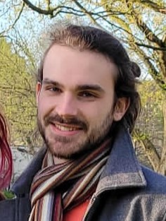

 

Welcome to my web page!

I am a third year PhD student at INSA Toulouse/Institut de Mathématiques de Toulouse (IMT), under the supervision of Pascal Noble (IMT/INSA) and Olivier Roustant (IMT/INSA). The PhD is funded by the Service Hydrographique et Océanographique de la Marine (SHOM), in collaboration with Rémy Baraille (SHOM) in particular.

The PhD is motivated by applying machine learning techniques to oceanography, coastal marine forecast and more broadly to physical models described by PDEs.

Prior to my PhD I spent some years on the Plateau de Saclay.

You can find my detailled CV (French) <a href="online_files/pdf/cv_french.pdf">here</a>.
