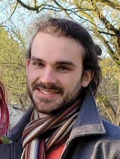

---
# Feel free to add content and custom Front Matter to this file.
# To modify the layout, see https://jekyllrb.com/docs/themes/#overriding-theme-defaults

layout: home
title: Home
---

 

Welcome to my web page!

I am currently a lecturer in applied mathematics (enseignant-chercheur, equivalent to "maître de conférence") at <a href="https://www.isae-supaero.fr/en/">ISAE-Supaéro</a>  since 2024. Between 2023 and 2024 I was a post doc at the <a href="https://www.math.univ-toulouse.fr/en/">Institut de Mathématiques de Toulouse (IMT)</a> under the supervision of Adrien Mazoyer and Fabrice Gamboa, working on multivariate conformal inference.

 I pursued my PhD in 2023 at <a href="https://www.insa-toulouse.fr/en/">INSA Toulouse</a>/IMT, under the supervision of Pascal Noble (IMT/INSA) and Olivier Roustant (IMT/INSA). The PhD was funded by the Service Hydrographique et Océanographique de la Marine (SHOM), in collaboration with Rémy Baraille (SHOM) in particular.

The PhD was motivated by applying machine learning techniques to oceanography, coastal marine forecast and more broadly to physical models described by PDEs.

Prior to my PhD I spent some years on the Plateau de Saclay.

You can find my detailled CV (French, last updated in December 2023) <a href="online_files/pdf/site_cv.pdf">here</a>.
