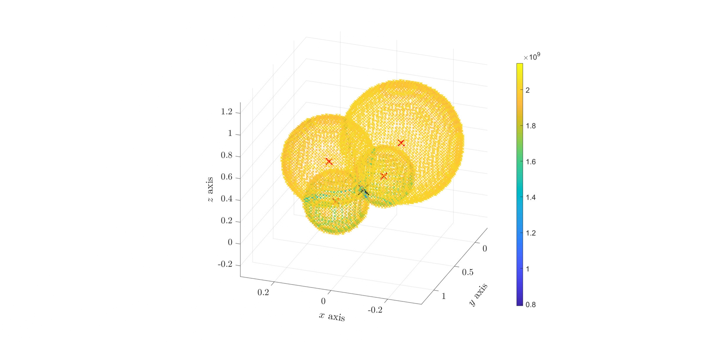

Here are some nice images I encountered during research. Most of these are not interesting scientifically speaking, I just think they are pretty.

  
  
  

  
  
  <figcaption>Time evolution of some 2D numerical error related to a wave equation. The value scale is of the order 10e-15 (machine precision), hence the "broken patterns" .</figcaption>

<figcaption>The level sets of the likelihood function associated to a well-chosen covariance function remind GPS localization methods. See this <a href="online_files/pdf/gpr_ivp.pdf">article</a> for details and explanations.</figcaption>

